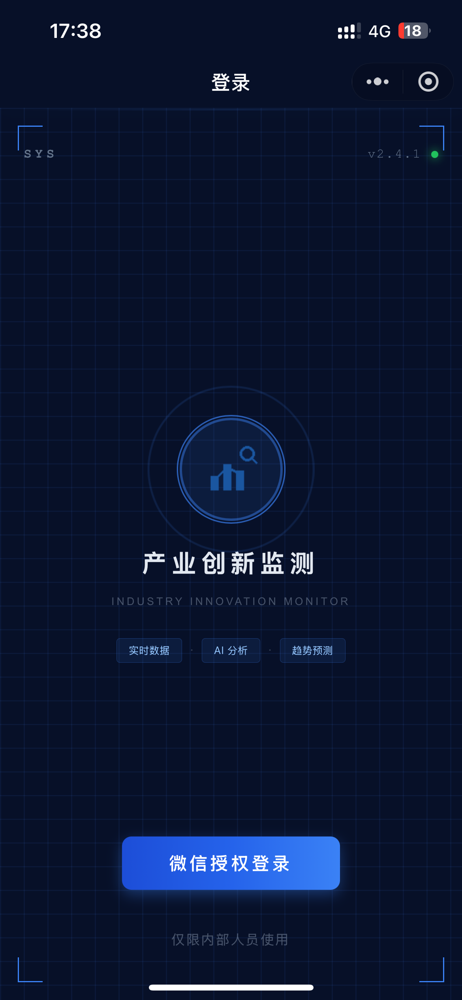
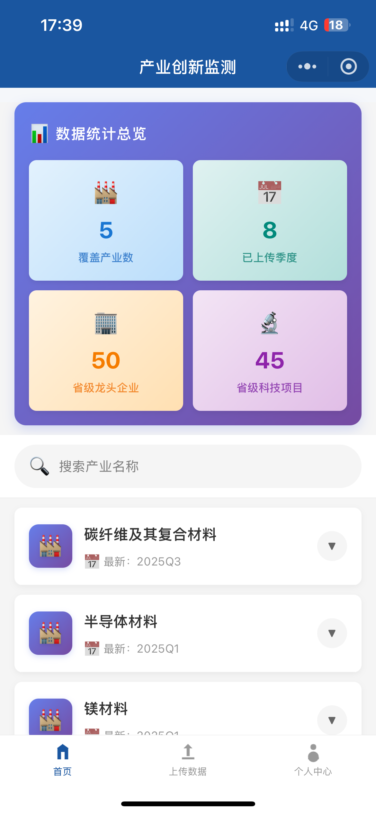
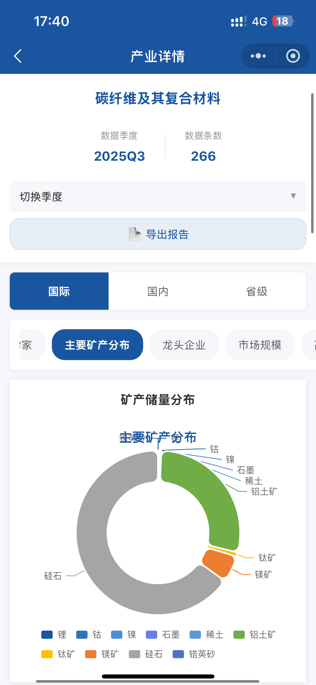
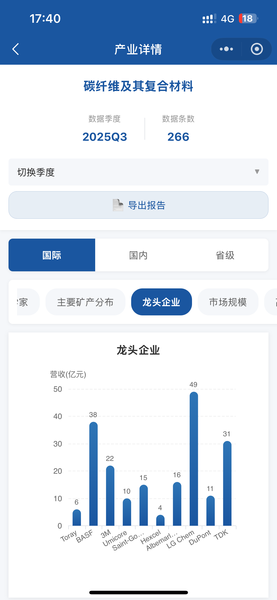
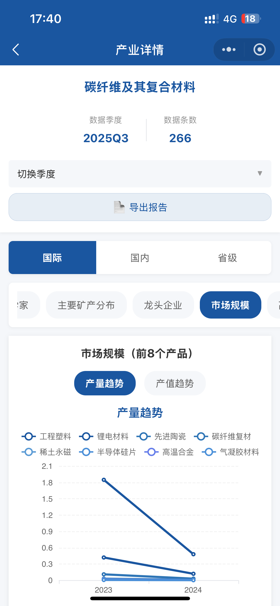
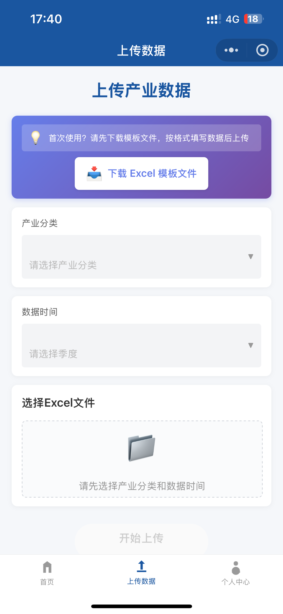
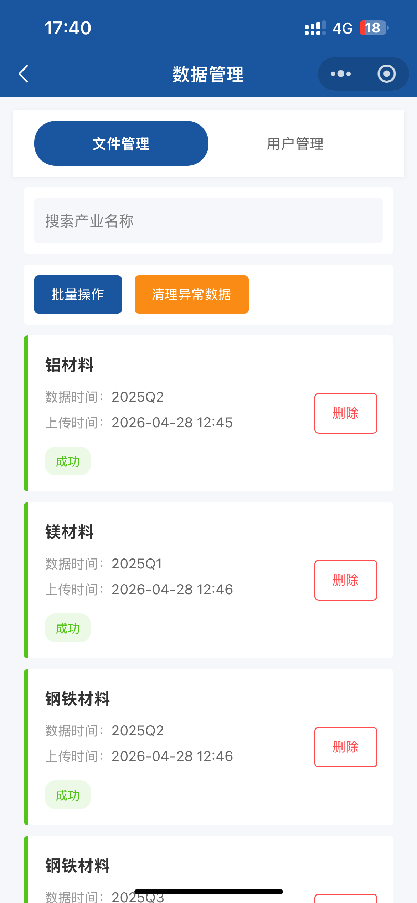

# 产业监测小程序 | Industry Monitor Mini Program

<p align="center">
  <strong>一款基于微信云开发的产业数据监测与管理小程序</strong>
</p>

<p align="center">
  
  
  
</p>

---

## 📖 项目简介

产业监测小程序是一款面向产业数据管理的移动端解决方案，支持产业数据的上传、查看、分析与管理。通过微信小程序的便捷性和云开发的强大能力，为企业提供高效的产业监测工具。

### ✨ 核心特性

- 🔐 **微信授权登录** - 快速安全的用户身份认证
- 📊 **产业数据展示** - 清晰的产业列表与数据统计
- 📤 **Excel数据上传** - 支持批量导入产业数据
- 👥 **权限管理** - 管理员/查阅者角色分离
- 🗂️ **数据管理** - 完善的数据增删改查功能
- 🔍 **智能搜索** - 快速定位目标产业
- 📱 **响应式设计** - 适配各种移动设备

---

## 📸 功能截图

### 登录页面

> 微信授权登录，安全快捷

### 首页 - 产业列表

> 产业数据一览，支持搜索与展开查看

### 产业详情页 - 数据可视化
<table>
  <tr>
    <td></td>
    <td></td>
    <td></td>
  </tr>
  <tr>
    <td align="center">数据图表展示</td>
    <td align="center">趋势分析</td>
    <td align="center">统计信息</td>
  </tr>
</table>

> 三个可视化数据页面，提供多维度的产业数据分析

### 数据上传（管理员）

> 支持Excel模板下载与数据上传

### 管理后台（管理员）

> 数据管理与用户权限管理

### 个人中心

> 用户信息与设置

---

## 🛠️ 技术栈

### 前端
- **微信小程序** - 官方小程序框架
- **ECharts** - 数据可视化图表库
- **WXML/WXSS** - 小程序页面结构与样式

### 后端
- **微信云开发** - Serverless云函数
- **云数据库** - NoSQL数据存储
- **云存储** - 文件存储服务

### 核心云函数
| 云函数 | 功能描述 |
|--------|---------|
| `getUserRole` | 获取用户角色权限 |
| `getIndustries` | 获取产业列表 |
| `getIndustryData` | 获取产业详细数据 |
| `parseExcel` | 解析Excel文件并存储 |
| `getUploads` | 获取上传记录列表 |
| `deleteUpload` | 删除单条上传记录 |
| `batchDeleteUploads` | 批量删除上传记录 |
| `getUsers` | 获取用户列表 |
| `updateUserRole` | 更新用户角色 |
| `exportPDF` | 导出PDF报告 |
| `cleanLegacyData` | 清理历史遗留数据 |
| `cleanPendingUploads` | 清理僵尸记录 |

---

## 📁 项目结构

```
industry-monitor-V1/
├── pages/                      # 页面文件
│   ├── login/                  # 登录页
│   ├── home/                   # 首页（产业列表）
│   ├── industry/               # 产业详情页
│   ├── upload/                 # 数据上传页（管理员）
│   ├── admin/                  # 管理后台（管理员）
│   └── profile/                # 个人中心
├── cloudfunctions/             # 云函数
│   ├── getUserRole/            # 用户角色获取
│   ├── getIndustries/          # 产业列表获取
│   ├── getIndustryData/        # 产业数据获取
│   ├── parseExcel/             # Excel解析
│   ├── getUploads/             # 上传记录获取
│   ├── deleteUpload/           # 删除上传记录
│   ├── batchDeleteUploads/     # 批量删除
│   ├── getUsers/               # 用户列表获取
│   ├── updateUserRole/         # 角色更新
│   ├── exportPDF/              # PDF导出
│   ├── cleanLegacyData/        # 数据清理
│   └── cleanPendingUploads/    # 僵尸记录清理
├── ec-canvas/                  # ECharts组件
├── images/                     # 图片资源
├── utils/                      # 工具函数
│   ├── constants.js            # 常量配置
│   └── theme.js                # 主题配置
├── app.js                      # 小程序入口
├── app.json                    # 小程序配置
├── app.wxss                    # 全局样式
└── 测试用例文档.md             # 测试文档

```

---

## 🚀 快速开始

### 前置要求

- 微信开发者工具
- 微信小程序账号
- 微信云开发环境

### 安装步骤

1. **克隆项目**
   ```bash
   git clone https://github.com/your-username/industry-monitor-V1.git
   cd industry-monitor-V1
   ```

2. **配置云开发环境**
   - 在微信开发者工具中打开项目
   - 开通云开发服务
   - 记录云环境ID

3. **配置云函数**
   - 在各云函数的 `config.json` 中配置环境ID
   - 右键云函数目录，选择"上传并部署：云端安装依赖"

4. **配置数据库**
   - 创建以下集合（Collection）：
     - `users` - 用户信息
     - `industries` - 产业数据
     - `uploads` - 上传记录

5. **配置云存储**
   - 上传Excel模板到云存储
   - 在 `pages/upload/index.js` 中配置 `templateFileID`

6. **运行项目**
   - 点击"编译"按钮
   - 使用微信扫码预览

---

## 👥 用户角色

### 管理员（Admin）
- ✅ 查看所有产业数据
- ✅ 上传Excel数据
- ✅ 管理上传记录
- ✅ 管理用户权限
- ✅ 删除数据

### 查阅者（Viewer）
- ✅ 查看产业数据
- ❌ 上传数据
- ❌ 管理功能

---

## 📋 功能清单

### 登录模块
- [x] 微信授权登录
- [x] 登录状态缓存（7天）
- [x] 自动登录
- [x] 角色识别

### 首页模块
- [x] 产业列表展示
- [x] 数据统计总览
- [x] 产业搜索
- [x] 季度数据展开/收起
- [x] 下拉刷新

### 数据上传模块（管理员）
- [x] 产业分类选择
- [x] 自定义产业分类
- [x] 季度时间选择
- [x] Excel模板下载
- [x] 文件格式校验
- [x] 文件大小限制（10MB）
- [x] 上传进度显示
- [x] 自动解析Excel

### 管理后台模块（管理员）
- [x] 上传记录列表
- [x] 记录搜索
- [x] 单条删除
- [x] 批量删除
- [x] 自动清理僵尸记录
- [ ] 用户管理（待开发）

### 个人中心
- [x] 用户信息展示
- [x] 角色显示
- [x] 退出登录

---

## 🔧 开发说明

### 环境配置

在 `utils/constants.js` 中配置云环境：

```javascript
module.exports = {
  CLOUD_ENV: 'your-cloud-env-id',
  TEMPLATE_FILE_ID: 'cloud://your-file-id'
}
```

### Excel模板格式

上传的Excel文件应包含以下字段：
- 产业名称
- 时间周期（格式：2026Q1、2026Q2等）
- 企业数量
- 项目数量
- 其他自定义字段

### 数据库结构

**users集合**
```javascript
{
  _id: "auto-generated",
  _openid: "user-openid",
  role: "admin" | "viewer",
  createTime: Date,
  updateTime: Date
}
```

**industries集合**
```javascript
{
  _id: "auto-generated",
  industryName: String,
  timePeriod: String,  // 格式：2026Q1
  data: Object,
  createTime: Date,
  _openid: String
}
```

**uploads集合**
```javascript
{
  _id: "auto-generated",
  industryName: String,
  timePeriod: String,
  fileName: String,
  fileID: String,
  status: "pending" | "success" | "failed",
  uploadTime: Date,
  _openid: String
}
```

---

## 🧪 测试

项目包含完整的测试用例文档，覆盖以下模块：
- 登录模块（8条测试用例）
- 首页模块（12条测试用例）
- 数据上传模块（18条测试用例）
- 管理后台模块（15条测试用例）
- 权限控制（6条测试用例）
- 数据验证（5条测试用例）
- UI/UX（3条测试用例）
- 异常场景（3条测试用例）

详见：[测试用例文档.md](./测试用例文档.md)

---

## 🔒 安全特性

- ✅ 微信官方身份认证
- ✅ OpenID绑定用户
- ✅ 角色权限控制
- ✅ 云函数安全规则
- ✅ 文件格式校验
- ✅ XSS防护（特殊字符过滤）
- ✅ 登录状态缓存加密

---

## 📝 待优化功能

- [ ] 用户管理页面完善
- [ ] PDF导出功能集成
- [ ] 数据导出功能
- [ ] 批量操作二次确认
- [ ] 文件上传进度优化
- [ ] 错误日志上报机制
- [ ] 数据可视化图表
- [ ] 数据对比功能

---

## 🤝 贡献指南

欢迎提交 Issue 和 Pull Request！

1. Fork 本仓库
2. 创建特性分支 (`git checkout -b feature/AmazingFeature`)
3. 提交更改 (`git commit -m 'Add some AmazingFeature'`)
4. 推送到分支 (`git push origin feature/AmazingFeature`)
5. 提交 Pull Request

---

## 📄 许可证

本项目采用 MIT 许可证 - 详见 [LICENSE](LICENSE) 文件

---

## 👨‍💻 作者

**WJ**

---

## 📧 联系方式

如有问题或建议，欢迎通过以下方式联系：

- 提交 [Issue](https://github.com/your-username/industry-monitor-V1/issues)
- Email: your-email@example.com

---

## 🙏 致谢

- 感谢微信小程序团队提供的开发平台
- 感谢 ECharts 团队提供的图表库
- 感谢所有为本项目做出贡献的开发者

---

<p align="center">
  Made with ❤️ by WJ
</p>
